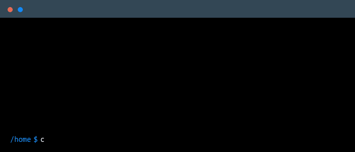

<!-- 
    This readme is a copy of https://github.com/daria-stanilevici/daria-stanilevici,
 -->

<!-- 
    Header & Footer wave image from: https://capsule-render.vercel.app/
 -->
 

<!--
    Your own Terminal GIF can be created here -> https://www.terminalgif.com
-->

    

### Main skills

### Studying

### About me

I'm a Computer Science student at UC and passionate about technology, Open Source, with self-taught experience in Linux environments.

My curiosity led me to explore Linux and start programming with Python. Today I'm involved in collaborative Open Source projects where I continue learning technologies like Astro, TypeScript and TailwindCSS.

I'm enthusiastic about exploring different areas of computing, from frontend development to Linux system administration. My current focus is on constant learning, contributing with commitment and building a solid foundation for my professional future in technology.

### Connect with me!

    

> [!IMPORTANT]  
> <a href="https://github.com/daria-stanilevici/daria-stanilevici" download>Readme inspired by Daria Stailevici</a>

 